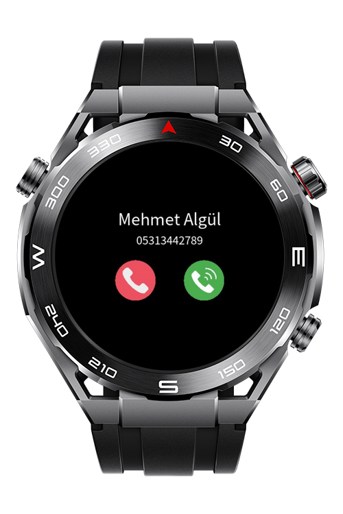
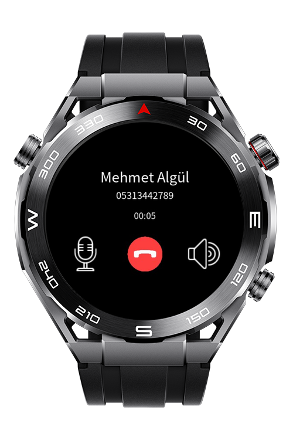
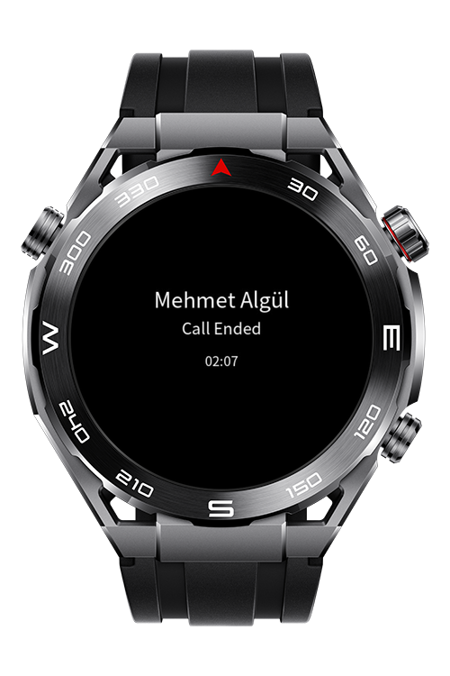
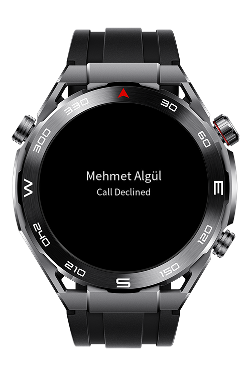

> **Note:** To access all shared projects, get information about environment setup, and view other guides, please visit [Explore-In-HMOS-Wearable Index](https://github.com/Explore-In-HMOS-Wearable/hmos-index).

# How to Create Dynamic Screen Changes With Vibration as Optional

This application demonstrates dynamic screen transitions by simulating a phone call scenario. It features a fake incoming call screen where users can accept or decline, leading to a subsequent call screen. The flow is designed to showcase smooth UI changes, with vibration available as an optional feedback mechanism.

# Preview

<div>
  
  
  
  
</div>

# Use Cases

1. Users can start the application and an incoming call screen is started as a fake screen
2. Users can decline or accept the fake call.
3. If users accept the call, a call screen starts like a real call scenario.

# Technology

## Stack

- **Languages**: ArkTS, ArkUI
- **Frameworks**: HarmonyOS 5.1.0(18)
- **Tools**: DevEco Studio Vers 5.1.0.828SP1,
- **Libraries**: @system.app, @system.vibrator

## Required Permissions

- `ohos.permission.VIBRATION`
  > Required to provide vibration.


# Directory Structure

```
│   config.json
│
├───js
│   └───MainAbility
│       │   app.js
│       │
│       ├───common
│       │       avatar.png
│       │       callAccept.png
│       │       callClose.png
│       │       callDecline.png
│       │       microphone.png
│       │       speaker.png
│       │
│       ├───i18n
│       │       en-US.json
│       │       zh-CN.json
│       │
│       └───pages
│           └───index
│                   index.css
│                   index.hml
│                   index.js
│
└───resources
    ├───base
    │   ├───element
    │   │       string.json
    │   │
    │   └───media
    │           icon.png
    │           icon_small.png
    │
    └───rawfile

```

# Constraints and Restrictions

## Suported Devices

- Huawei Sport (Lite) Watch GT 4/5/6
- Huawei Sport (Lite) GT4/5 Pro
- Huawei Sport (Lite) Fit 3/4
- Huawei Sport (Lite) D2
- Huawei Sport (Lite) Ultimate
- 
## Limitations

- Application needs to be launch on real devices to use vibration kit

# License

**Fake Call** is distributed under the terms of the MIT License.
See the [LICENSE](./LICENSE) for more information.


